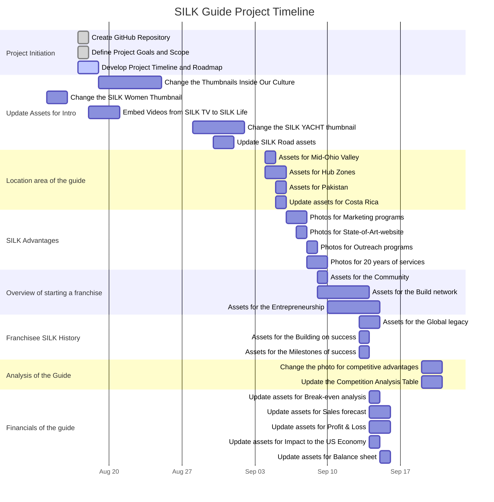

```mermaid
gantt
    title SILK Guide Project Timeline
    dateFormat  YYYY-MM-DD
    axisFormat %b %d

    section Project Initiation
    Create GitHub Repository           :done,    p1, 2023-08-17, 1d
    Define Project Goals and Scope     :done,    p2, 2023-08-17, 1d
    Develop Project Timeline and Roadmap:active, p3, 2023-08-17, 2d

    section Update Assets for Intro
    Change the Thumbnails Inside Our Culture    :        p4, 2023-08-19, 6d
    Change the SILK Women Thumbnail :        p5, 2023-08-14, 2d
    Embed Videos from SILK TV to SILK Life        :        p6, 2023-08-18, 3d
    Change the SILK YACHT thumbnail        :        p7, 2023-08-28, 5d
    Update SILK Road assets                :        p8, 2023-08-30, 2d

    section Location area of the guide
    Assets for Mid-Ohio Valley                   :        p09, 2023-09-04, 1d
    Assets for Hub Zones :        p10, 2023-09-04, 2d
    Assets for Pakistan  :        p11, 2023-09-05, 1d
    Update assets for Costa Rica         :        p12, 2023-09-05, 1d

    section SILK Advantages
    Photos for Marketing programs:        p13, 2023-09-06, 2d
    Photos for State-of-Art-website:        p14, 2023-09-07, 1d
    Photos for Outreach programs   :        p15, 2023-09-08, 1d
    Photos for 20 years of services:        p16, 2023-09-08, 2d 

    section Overview of starting a franchise
    Assets for the Community     :        p17, 2023-09-09, 1d
    Assets for the Build network    :        p18, 2023-09-09, 5d
    Assets for the Entrepreneurship    :        p19, 2023-09-10, 5d

    section Franchisee SILK History
    Assets for the Global legacy:        p20, 2023-09-13, 2d
    Assets for the Building on success:        p21, 2023-09-13, 1d
    Assets for the Milestones of success:        p22, 2023-09-13, 1d

    section Analysis of the Guide
    Change the photo for competitive advantages     :        p23, 2023-09-19, 2d
    Update the Competition Analysis Table           :        p24, 2023-09-19, 2d

    section Financials of  the guide
    Update assets for Break-even analysis             :        p25, 2023-09-14, 1d
    Update assets for Sales forecast             :        p26, 2023-09-14, 2d
    Update assets for Profit & Loss             :        p27, 2023-09-14, 2d
    Update assets for Impact to the US Economy             :        p28, 2023-09-14, 1d
    Update assets for Balance sheet             :        p29, 2023-09-15, 1d

```
