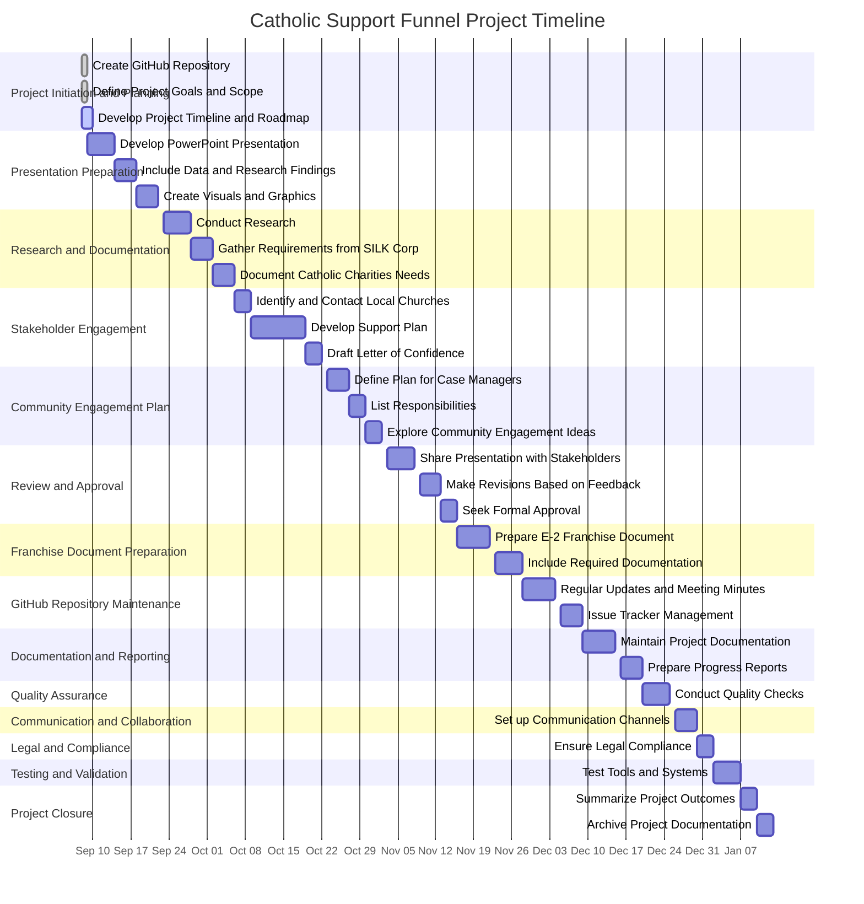

**Project Initiation and Planning**

-     Create GitHub Repository           :done,    2023-09-08, 1d
-     Define Project Goals and Scope     :done,   2023-09-08, 1d
-     Develop Project Timeline and Roadmap:active,  2023-09-08, 2d

**Presentation Preparation**

-     Develop PowerPoint Presentation    :        p4, 2023-09-09, 5d
-     Include Data and Research Findings :        p5, 2023-09-14, 4d
-     Create Visuals and Graphics        :        p6, 2023-09-18, 4d

**Research and Documentation**

-     Conduct Research                   :        p7, 2023-09-23, 5d
-     Gather Requirements from SILK Corp :        p8, 2023-9-28, 4d
-     Document Catholic Charities Needs  :        p9, 2023-10-02, 4d

**Stakeholder Engagement**

-     Identify and Contact Local Churches :        p10, 2023-10-06, 3d
-     Develop Support Plan               :        p11, 2023-10-09, 10d
-     Draft Letter of Confidence         :        p12, 2023-10-19, 3d

**Community Engagement Plan**

-     Define Plan for Case Managers      :        p13, 2023-10-23, 4d
-     List Responsibilities              :        p14, 2023-10-27, 3d
-     Explore Community Engagement Ideas :        p15, 2023-10-30, 3d

**Review and Approval**

-     Share Presentation with Stakeholders:        p16, 2023-11-03, 5d
-     Make Revisions Based on Feedback   :        p17, 2023-11-09, 4d
-     Seek Formal Approval               :        p18, 2023-11-13, 3d

**Franchise Document Preparation**

-     Prepare E-2 Franchise Document     :        p19, 2023-11-16, 6d
-     Include Required Documentation     :        p20, 2023-11-23, 5d
- 

**GitHub Repository Maintenance**

-     Regular Updates and Meeting Minutes:        p21, 2023-11-28, 6d
-     Issue Tracker Management           :        p22, 2023-12-05, 4d

**Documentation and Reporting**

-     Maintain Project Documentation     :        p23, 2023-12-09, 6d
-     Prepare Progress Reports           :        p24, 2023-12-16, 4d

**Quality Assurance**

-     Conduct Quality Checks             :        p25, 2023-12-20, 5d

**Communication and Collaboration**

-     Set up Communication Channels      :        p26, 2023-12-26, 4d

**Legal and Compliance**

-     Ensure Legal Compliance            :        p27, 2023-12-30, 3d

**Testing and Validation**

-     Test Tools and Systems             :        p28, 2024-01-02, 5d

**Project Closure**

-     Summarize Project Outcomes         :        p29, 2024-01-07, 3d

-     Archive Project Documentation      :        p30, 2024-01-10, 3d
