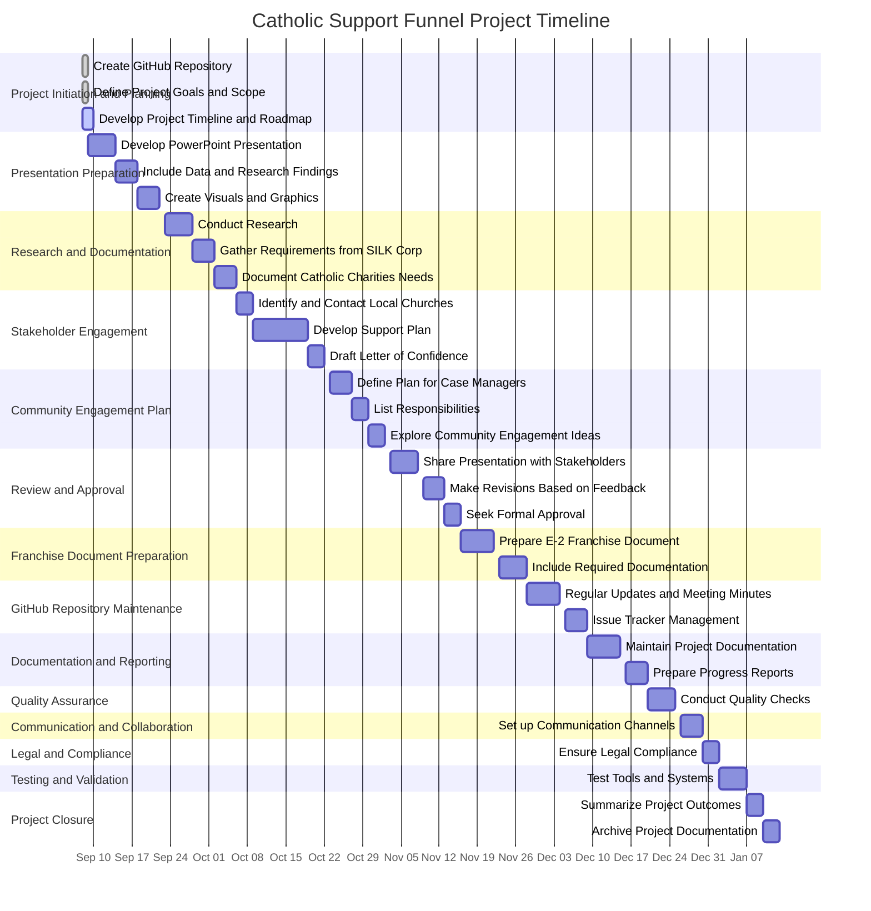

# Catholic community Funnel docummentation 
This milestone aims to create a comprehensive support funnel for Catholic individuals from international communities, particularly from the Philippines, in collaboration with local Catholic churches in the Mid-Ohio Valley region, including Parkersburg and Ravenswood.

The project is rooted in the need for a case management system for homeless individuals in Parkersburg, a requirement set forth by SILK Corp for housing these individuals. Currently, Catholic Charities, an organization with access to this homeless population, lacks a case manager.

The proposed solution is to leverage the skills of our international Catholic community members, who can serve as case managers overseeing the properties and managing the individuals housed in these properties. These individuals will also be responsible for property maintenance tasks such as roofing and painting, thus creating a mutually beneficial arrangement.

Support from local Catholic churches will be sought in the form of a letter of confidence or a similar document endorsing the plan. The case managers may also facilitate events in these SILK Homes owned by SILK Corp, further fostering community engagement.

Upon approval of the funnel, which will be initially presented in a PowerPoint format, an E-2 Franchise document will be prepared for submission to the USCIS.

This milestone is a significant step towards our goal of providing housing solutions for the homeless while also creating opportunities for international Catholic community members to contribute meaningfully to the local community.

For this version, we are putting up a funnel for Catholics but the next versions can be used by any organization. The SILK homes are just a space for any organization to use. They can do fund-raising activities through these homes and a case/property manager from SILK Corp can work with these organizations to help facilitate their events/activities in the SILK Homes. The SILK Homes can get a percentage from the funds raised from these events. These funds can be used to hire local talents for the YACHT Services (Yoga, Arts, Cafe, Home, Tech). This is how SILK Corp empowers the community. 

---

### Tasks for the Project

1. **Project Initiation and Planning:**
   - [X] Create a new GitHub repository for the project.
   - [X] Define project goals, scope, and milestones.
   - [ ] Develop a project timeline and roadmap.

2. **Presentation Preparation:**
   - [ ] Develop a PowerPoint presentation outlining the comprehensive support funnel plan.
   - [ ] Include relevant data, research findings, and proposed solutions in the presentation.
   - [ ] Create visuals and graphics to enhance the presentation.

3. **Research and Documentation:**
   - [ ] Conduct research on the homeless population in Parkersburg and their specific needs.
   - [ ] Gather information about the requirements set by SILK Corp for housing homeless individuals.
   - [ ] Document the current situation of Catholic Charities and their need for a case manager.

4. **Stakeholder Engagement:**
   - [ ] Identify and contact local Catholic churches in the Mid-Ohio Valley region.
   - [ ] Develop a plan to seek support and endorsements from these churches.
   - [ ] Draft a letter of confidence or similar document for endorsement.

5. **Community Engagement Plan:**
   - [ ] Define a plan for involving international Catholic community members as case managers.
   - [ ] Create a list of responsibilities for case managers, including property management and maintenance.
   - [ ] Explore ways to foster community engagement and events in SILK Homes.

6. **Review and Approval:**
   - [ ] Share the PowerPoint presentation with relevant stakeholders for feedback.
   - [ ] Make necessary revisions based on feedback.
   - [ ] Seek formal approval or endorsement from key stakeholders.

7. **Franchise Document Preparation:**
   - [ ] Start preparing the Franchise document (E-2, EB-2, or Q Visa) for submission to the USCIS.
   - [ ] Ensure that all required documentation and information are included in the application.

8. **GitHub Repository Maintenance:**
   - [ ] Regularly update the GitHub repository with project progress, meeting minutes, and relevant documents.
   - [ ] Use the repository's issue tracker to manage ongoing tasks and discussions.

9. **Documentation and Reporting:**
   - [ ] Maintain thorough documentation of all project activities, decisions, and outcomes.
   - [ ] Prepare regular progress reports for project stakeholders.

10. **Quality Assurance:**
    - [ ] Conduct quality checks on all project deliverables, including the PowerPoint presentation and franchise document.

11. **Communication and Collaboration:**
    - [ ] Set up communication channels for team members to collaborate effectively (e.g., Slack, Teams, or email).

12. **Legal and Compliance:**
    - [ ] Ensure that all actions and documents comply with relevant legal and immigration regulations.

13. **Testing and Validation:**
    - [ ] Test any tools or systems developed as part of the project to ensure they function as intended.

14. **Project Closure:**
    - [ ] Summarize the outcomes of the project.
    - [ ] Archive the GitHub repository and project documentation for future reference.

This order should help you prioritize your tasks effectively.

---

### Links:

[Support_Funnel.md](https://github.com/NoteHive/Silk-Corp-Guide/blob/main/notes/Support%20Funnel.md)
