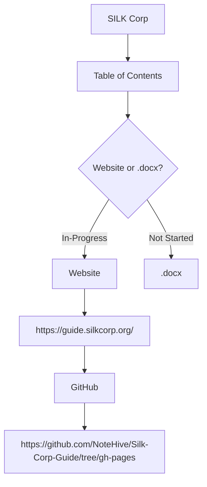
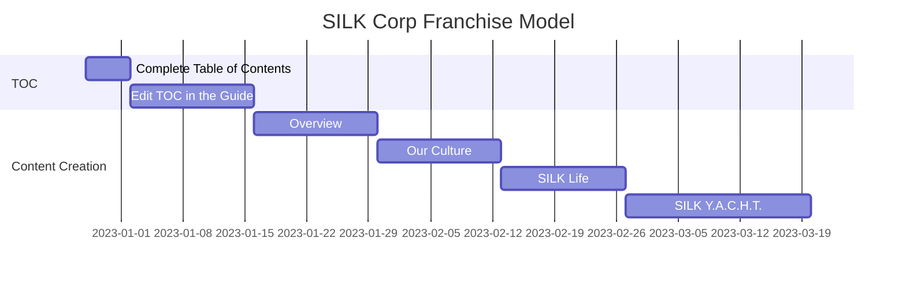
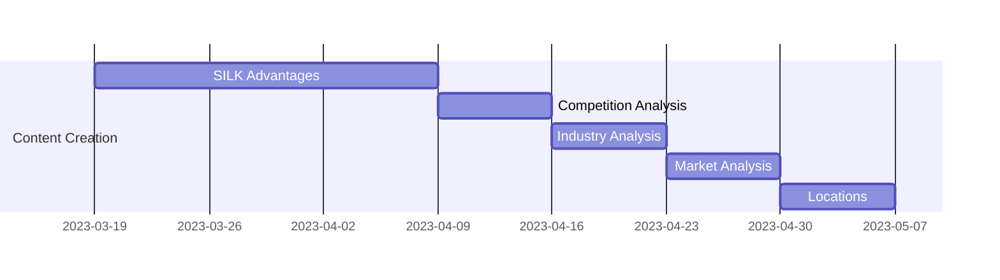
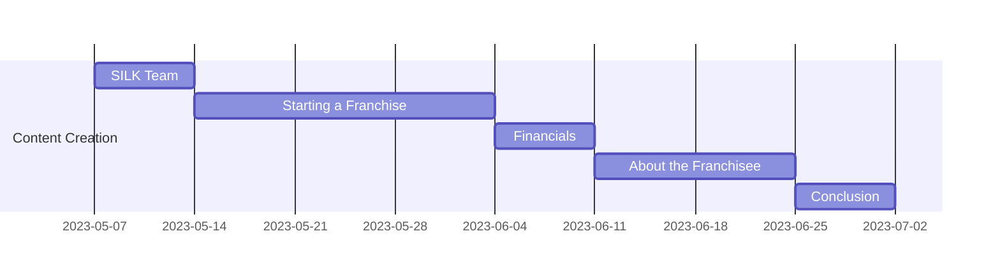

# Space
The SILK Franchise Model aims to create a website that will help franchisees learn how to run a SILK Company. The website will contain a cleaned-up and migrated franchise model that can be forked by any client, and then the client can add an area for their credentials. This website will be printed out and used for immigration purposes. Development of the website is ongoing, and anyone can contribute by checking the [ReadMe file](https://github.com/NoteHive/Silk-Corp-Guide/tree/gh-pages) to see how to contribute.

The [Table of Contents (TOC)](https://github.com/NoteHive/Silk-Corp-Guide/blob/gh-pages/research/TableOfContents.md) for the franchise model has already been established on the website. The TOC can be used in a document, and it can be edited and printed for a franchisee. The Business Plan Models from [Joorney](https://www.joorney.com/#pre-samples) or SILK Corp OneNote Notebook can also help in creating the Table of Contents. Before implementation, it should be approved by an executive.

# Track
This markdown file serves as a roadmap to help in the creation of the SILK Corp Franchise Guide.

---

## Gantt Chart

This Gantt Chart shows how the tasks are completed for a SILK Corp Business Plan in the Website.

# Assist
- [x] Check out the OneNote Notebook for SILK Corp to see the existing Table of Contents
- [x] Research on Joorney Sites for helpful contents
- [x] Create Table of Contents and find any research in the "research" folder in the gh-pages branch.
- [x] Have it approved by an executive.
- [x] Change I to Integrity
- [x] Change K to Knowledge
- [ ] In the Narrative, talk about all SILK Values in the YACHT. like talk about the SILK in Yoga, SILK in arts and for Cafe, Home, and Tech
- [ ] Research what goes to the YACHT (Services) and the SILK Life (values) if it's empty.
- [x] Mission is general SILK Life, then there's SILK Women but include how children or toddlers can help or live the SILK Life with their family.
- [ ] Include the history of  SILK Road but revitalize the concept by bringing tech, innovation, remote/digital trade in that road; digital SILK Road can be wherever in the world. Bring work tko locals through the digital SILK Road; Check that UN or China plans in revitalizing the road
- [ ] Add statistics in services about women to work in "Halal" or biblical work
- [ ] In the Scholarship, to open a franchise, women run real estates or culinary arts etch, in the  SILK Department.
- [ ] In the Professional Experience, the franchisee should exhibit SILK values
- [ ] In the SERVICES, include children too in the narrative.

Other Notes:

- [ ] Each women brings different trades because of different culture and upbringing, and they network with each other to see what trade the other has to help her with her projects
- [ ] Note what SILK is; woven from smaller fibers, a strong fiber, mission to empower women to help their husbands and the society she is living in through the  SILK Life (Values) and SILK YACHT (Services)
- [ ] The narrative should include a story on how we hire temporary workers to cater to all the services we are offering. It's because it depends on the Clientele's needs and what concierge service they want. It can be a yoga session, dance session, massage, food, tour guides and for getaway activities, landscaper, roofer, plumber etc. The SILK Team/Franchisee will handle and find all these local consultants and the client only pays SILK. 
- [ ] 10-15% of the pay goes back to the franchisee and the rest goes back to the services in the area where the SILK Franchise is located.
- [ ] We can't provide the whole house to a single family unit because SILK will lose the ability to control in providing the YACHT services.
- [ ] The narrative should include people from big cities like New York for example wanting to work remotely in a quiet peaceful place. We become a destination for them. And SILK provides the SMART houses and the concierge services (fast internet, updated electrical outlets, BnB Services, SMART Devices, Kayaking and other amenities, for example). The money goes to these HubZones like Ravenswood City for example, instead of big cities like New York City. This open up jobs to local consultants in the city. 
- [ ] Also as the franchisee, you have your own tech team in a single house instead/aside from BnB clients then you are bringing in money to the city too through their rent and by giving services to these team members the same services you give to BnB guests.
- [ ] This is a small business and not for a franchisee that wants to scale big.
- [ ] As a franchisee it helps balance life needs for example, if the franchisee only wants to get a 6-month tech contract and then rest after that period and focus on the hospitality business, then at least there's still a flow of money. Then the franchisee can go back to do the tech jobs after focusing on just hospitality business. 
- [ ] These tech jobs can pay for the rent and the services and goes in tandem with the hospitality business.
- [ ] A franchisee's profile is written in the About the Franchisee area. Make it a general concept so that it's easier to edit for each franchisee.

# Reach
The reach of the SILK Franchise Model is for E-2 or L-1 Visa holders that upholds the SILK values.
