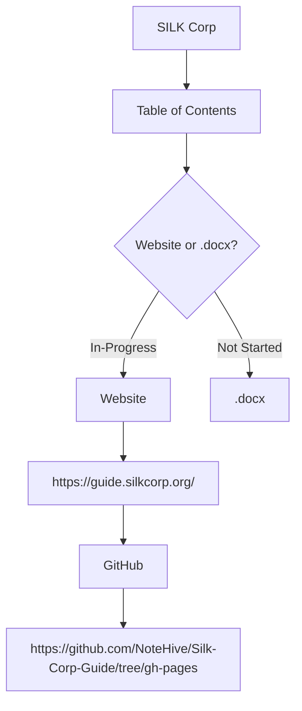
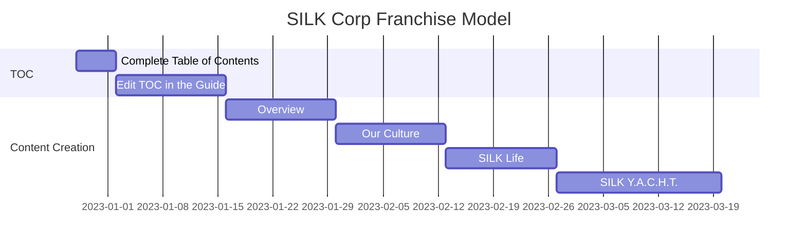
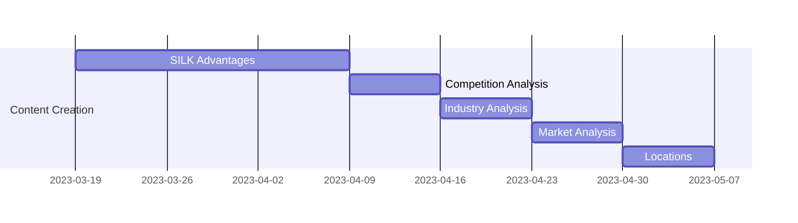
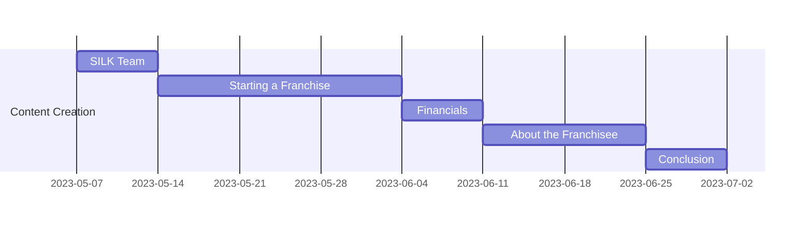

This will serve as a General S.T.A.R. for the SILK Corp Franchise Model. Smaller tasks or issues can be created out of this general STAR to reach our end goal which is to have a franchise model to be submitted to the US Government.

## :cyclone: Space
The SILK Franchise Model aims to create a website that will help franchisees learn how to run a SILK Company. The website will contain a cleaned-up and migrated franchise model that can be forked by any client, and then the client can add an area for their credentials. This website will be printed out and used for immigration purposes. Development of the website is ongoing, and anyone can contribute by checking the [ReadMe file](https://github.com/NoteHive/Silk-Corp-Guide/tree/gh-pages) to see how to contribute.

The [Table of Contents (TOC)](https://github.com/NoteHive/Silk-Corp-Guide/blob/gh-pages/research/TableOfContents.md) for the franchise model has already been established on the website. The TOC can be used in a document, and it can be edited and printed for a franchisee. The Business Plan Models from [Joorney](https://www.joorney.com/#pre-samples) or SILK Corp OneNote Notebook can also help in creating the Table of Contents. Before implementation, it should be approved by an executive.

## :bridge_at_night: Track
This Track file serves as a roadmap to help in the creation of the SILK Corp Franchise Guide. There's still a question as to use a .docx or the website to get printed.

---

### Timeline of Tasks :alarm_clock:

This Gantt Chart shows how the tasks are completed for a SILK Corp Business Plan in the Website.

## :construction_worker: Assist

To assist in this project refer to the research/meetings/first_notes.md file. It has the initial meeting notes in bulleted list form. The tasks here can be made into smaller issues to help in steering the project.

To summarize, the initial task was to design the Table of Contents. After it's established, work on the content on the list in the Table of Contents. The narrative for the franchise model will talk about all SILK Values in the YACHT, including SILK in Yoga, SILK in Arts, and SILK for Cafe, Home, and Tech. The franchise model will also include the history of the Silk Road, but it will be revitalized by bringing in tech, innovation, and remote/digital trade. The digital Silk Road can be wherever in the world, and it can bring work to locals through the digital Silk Road. The franchise model will also include statistics about women working in "Halal" or biblical work.

In the narrative it should mention that women can run real estates or culinary arts, and the franchisee should exhibit SILK values in their professional experience. The franchise model's SERVICES should also include children in the narrative, and temporary workers will be hired to cater to all the services offered by the franchise. The SILK team/franchisee will handle and find all these local consultants, and the client only pays SILK.

It should include 10-15% of the pay goes back to the franchisee, and the rest goes back to the services in the area where the SILK Franchise is located. SILK cannot provide the whole house to a single family unit because SILK will lose the ability to control in providing the YACHT services. The narrative should also include people from big cities like New York who want to work remotely in a quiet peaceful place. SILK provides the SMART houses and the concierge services, and the money goes to these HubZones like Ravenswood City, providing jobs for local consultants.

The Narrative should also include that as a franchisee, you can have your own tech team in a single house aside from BnB clients with the hospitality business, and you can bring in money to the city too through their rent and by giving services to these team members the same services you give to BnB guests. This is a small business and not for a franchisee that wants to scale big. As a franchisee, it helps balance life needs, and the franchisee can focus on either the tech or hospitality business.

## :chart_with_upwards_trend: Reach

The SILK Franchise Model's reach is for E-2 or L-1 Visa holders who uphold the SILK values. The franchise model is designed for women who bring different trades due to their culture and upbringing, and they can network with each other to help each other with their projects. The SILK Franchise Model's mission is to empower women to help their husbands and the society they are living in through the SILK Life (Values) and SILK YACHT (Services).
