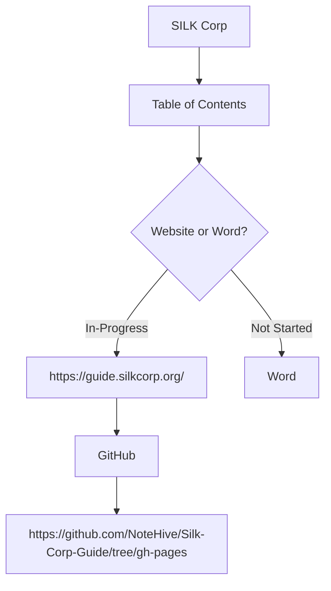
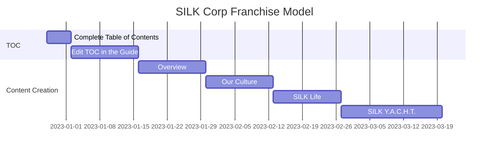
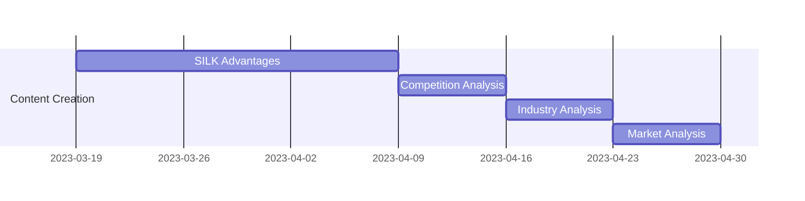

## Overview

This markdown file serves as a roadmap to help in the creation of the SILK Corp Franchise Guide.

---

## Gantt Chart

This Gantt Chart shows how the tasks are completed for a SILK Corp Business Plan in the Website.

